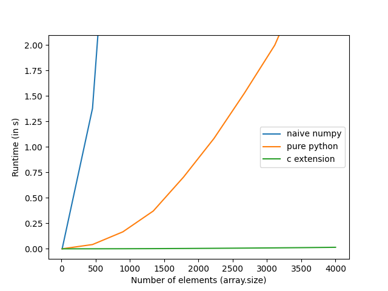

# C-Extensions for Pandas

This package contains an example of how to write a pandas extension in C.
Doing so is useful for two things:

- You can write _fast_(!!) transformations for ETL pipelines.
- You can vastly improve the memory efficiency of complex transformations.

The example used here implements
[`sample_entropy`](https://en.wikipedia.org/wiki/Sample_entropy), a metric that
quantifies the amount of "turbulence" in a timeseries. To compare performance,
it also provides two reference implementations. The first naively uses numpy and
tries to closely match the definition of sample entropy. The second uses and
optimized algorithm (lower overhead) that matches the implementation used for
the C kernel.

## Example

```python
import pandas as pd
import numpy as np

# register the pandas extension
import local.pandas_extension

# a regular series has 0 sample entropy
sequence = pd.Series([0, 1, 0, 1, 0, 1, 0, 1, 0, 1, 0, 1, 0, 1, 0, 1,], dtype=float)
sequence.local.sample_entropy_c(window_size=2)  # 0.0

# an irregular series has sample entropy > 0
sequence2 = pd.Series([0, 1, 0, 0, 1, 0, 1, 0, 0, 1, 1, 1, 1, 0, 0, 1,], dtype=float)
sequence2.local.sample_entropy_c(window_size=2)  # 0.587786664902119
```

## Installation

Since the project is not available on pypi, you install it by cloning the repo
and calling

```
poetry install
```

This assumes you have a (any?) C compiler installed and available on your path.

## Benchmark

As mentioned above, a C kernel will give you a vast performance improvement over
pure python or naive numpy implementations. To visualize this, you can use the
provided `benchmark.py` that measures the runtime for various sequence lengths.


(Run on a AMD Ryzen 7 5800X 8-Core Processor)
